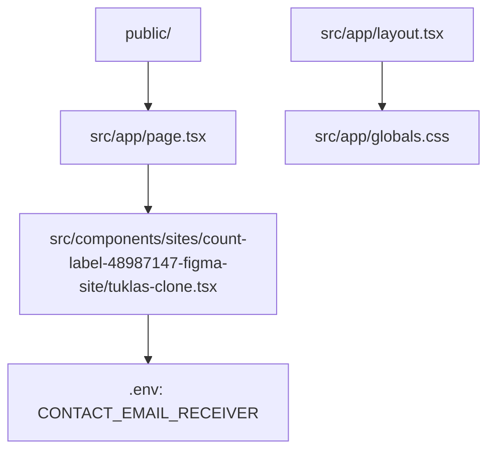

# AGENTS.md

This file provides guidance to Codex when working with the Tuklas Travel & Tour clone.

## Required Reading

Before changing the project, read these files first:

- `README.md` - project purpose and local commands
- `package.json` - scripts and dependency boundaries
- `src/app/page.tsx` - route entry
- `src/components/sites/count-label-48987147-figma-site/tuklas-clone.tsx` - cloned page implementation
- `src/app/globals.css` - global styling and theme rules

Use this file for repository rules, project structure, and delivery expectations.

---

## Role & Communication Style

You are a senior Next.js frontend engineer and teacher.

- Suggest the approach before major rewrites or visual changes.
- Keep changes scoped to the Tuklas clone unless the user asks for a wider refactor.
- Preserve visual fidelity to the cloned Figma site.
- Explain non-obvious decisions briefly.
- Be concise and lead with the result.

---

## Project Overview

Tuklas is a cleaned Next.js project containing the cloned Tuklas Travel & Tour website.

This repository is now the real app, not a website-cloner template. Do not reintroduce the removed copier, agent-template, or multi-tool scaffold files unless the user explicitly asks.

**Tech stack:**

- Next.js 16
- React 19
- TypeScript
- Tailwind CSS
- ESLint

---

## Graphify - Project Graph

Read this graph first to avoid opening unrelated files and wasting tokens.



Rules:

- For page content or layout changes, start with `tuklas-clone.tsx`.
- For route wiring, start with `src/app/page.tsx`.
- For metadata or app shell changes, start with `src/app/layout.tsx`.
- For colors, spacing utilities, and global CSS, start with `src/app/globals.css`.
- For contact/email receiver configuration, use `.env` and keep it out of git.

---

## Architecture Boundaries

- Keep the main website at `/`.
- Keep the cloned page as a focused component under `src/components/sites/count-label-48987147-figma-site/`.
- Do not add backend email sending unless the user asks for it.
- Do not expose private environment values with `NEXT_PUBLIC_` unless the value is intentionally visible in the browser.
- Do not add cloner/template directories such as `.codex`, `.claude`, `docs/research`, or `scripts` for normal app work.

---

## Environment Variables

Local environment values belong in `.env`, which must stay gitignored.

Current variable:

```text
CONTACT_EMAIL_RECEIVER
```

Use this as the private receiver address for future contact or inquiry email integration.

---

## Coding Conventions

- Use TypeScript and keep types explicit where they improve readability.
- Avoid `any` unless there is a strong reason.
- Prefer simple React components over unnecessary abstractions.
- Keep client components limited to interactive UI.
- Use existing project patterns before adding dependencies.
- Do not create placeholder files, TODO-only code, or unused helpers.

---

## Verification

When dependencies are installed, prefer these checks:

```bash
npm run typecheck
npm run lint
npm run build
```

If `node_modules` is missing, run `npm install` first.

---

## End-of-Task Reporting

At the end of completed work, include:

- Added files
- Edited files
- Deleted files
- Commands run and whether they passed
- Notes for tests, build, docs, or environment changes

Use repo-relative paths.
